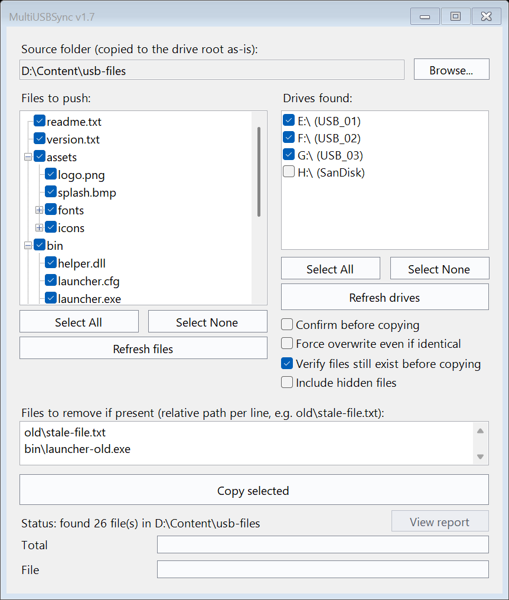
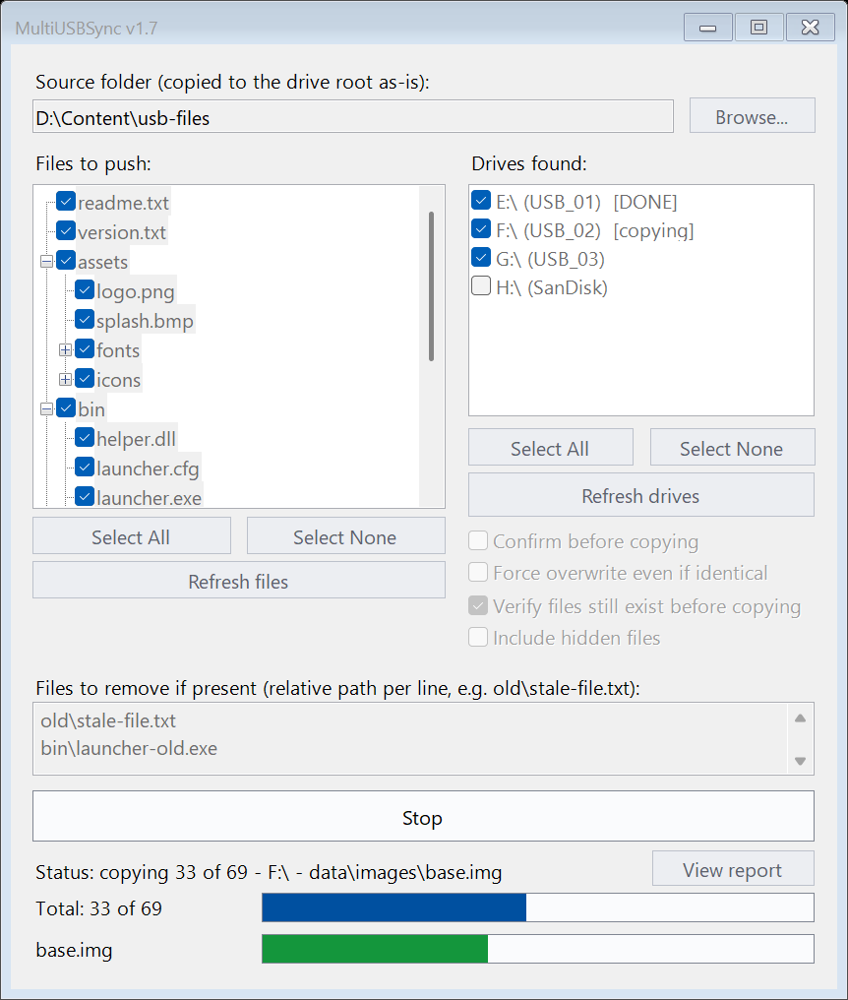
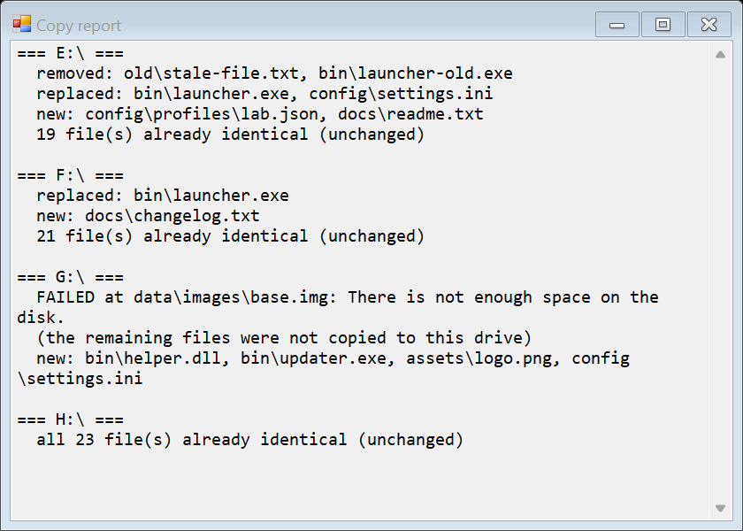

# MultiUSBSync

A small WinForms GUI for pushing a folder's contents onto one or more
removable USB drives at once. Plain PowerShell + WinForms - no
external dependencies, no build step, no install.

- Pick a source folder once; it's remembered next time.
- Copies only what changed - hash comparison skips identical files.
- Byte-level progress on both hashing and copying, so a large file
  never makes the window look frozen.
- Drives are done one at a time, each showing its own `[copying]` /
  `[DONE]` status.
- Optional, off-by-default cleanup list for deleting specific
  known-stale files from already-populated drives - always confirmed
  by name before anything is deleted.

**Ready to copy** - pick a source folder, tick the files and drives:



**While copying** - drive 1 is `[DONE]`, drive 2 is `[copying]`. The blue bar
counts files x drives (`Total: 33 of 69`); the green bar is the progress of
the file being copied right now, captioned with its name (`base.img`).
Everything else is locked and the button turns into **Stop**:



**Report** - what changed on each drive, including a drive that failed
(here: out of space) without stopping the others:



*(The screenshots show a made-up example - drives `E:` to `H:` and placeholder
file names.)*

## Requirements

Windows only (WinForms). Works with the PowerShell that ships with
Windows 10/11 (Windows PowerShell 5.1) - nothing extra to install. The
window is DPI-aware, so text stays sharp and the layout scales on
displays set to 125% / 150% / 200%.

## Running it

Keep `MultiUSBSync.ps1` and `RunMultiUSBSync.bat` in the same folder,
then double-click `RunMultiUSBSync.bat`. (Double-clicking the `.ps1`
directly usually just opens it in a text editor, and PowerShell's
default execution policy can block an unsigned script either way -
the `.bat` runs it with `-ExecutionPolicy Bypass` for this one script
only, nothing system-wide.)

## How it works

Pick a source folder with **Browse...**. Its contents get copied to
each selected drive's root, one relative path to another:

```
<SourceRoot>\bin\launcher.exe   ->  <drive>:\bin\launcher.exe
<SourceRoot>\assets\logo.png    ->  <drive>:\assets\logo.png
```

Structure the source folder to already look like a drive's root
should look, point the tool at it, and everything under it lands in
the matching place. The picked folder is remembered between runs, in
`MultiUSBSync.settings.json` next to the script (gitignored - it's
just a local path, specific to whoever's machine runs the tool).

## The window

| Control | What it does |
|---|---|
| **Source folder / Browse...** | Pick the folder to copy from. Path shown read-only; remembered for next time. |
| **Files to push** | Every file under the source folder, as a collapsed tree - expand a folder to see and check individual files. Checking/unchecking a folder cascades to everything inside it, and a folder stays ticked only while something inside it is ticked. **Select All** / **Select None** toggle everything at once. |
| **Drives found** | Every ready removable drive currently connected, shown as `E:\ (VOLUME_LABEL)` - helps tell drives apart at a glance. **Refresh drives** re-scans after plugging in or swapping one. |
| **Confirm before copying** | Off by default. When on, shows a Yes/No dialog listing exactly what's about to be copied and where, before anything happens. |
| **Force overwrite even if identical** | Off by default. Re-copies a file even when it's byte-for-byte identical to what's already there. |
| **Verify files still exist before copying** | On by default. Catches a file that was checked in the tree but has since been deleted or renamed on disk, before the copy starts. |
| **Include hidden files** | Off by default. Hidden files and folders under the source folder are left out of the tree unless this is ticked (the tree re-scans when you change it). |
| **Files to remove if present** | A hand-typed list of relative paths (one per line), remembered between runs. Empty by default - nothing is ever deleted unless something is listed here. See [Cleaning up stale files](#cleaning-up-stale-files) below. |
| **Copy selected** | Runs the removal step (if anything's listed and confirmed), then copies the checked files to the checked drives. Two progress bars: blue = the total (files x drives, e.g. `Total: 33 of 69`), green = the file being copied right now, captioned with its name. While it runs the button reads **Stop**. |
| **View report** | Opens a non-modal window listing what actually changed, one block per drive. Disabled when there's nothing to report. |

Works whether you have one drive plugged in or several at once (a
hub) - swap drives, click **Refresh drives**, and go again.

**No filtering on what's already on a drive.** Every ready removable
drive shows up, whether it already has content or is completely
blank - which also means there's no guardrail against picking an
unrelated USB stick by mistake. Double-check the drive path before
copying, especially with **Confirm before copying** switched on.

### Drives, one at a time

Each drive is processed fully before the next one starts. The drive
list shows `[copying]` then `[DONE]` next to each one as it goes,
since the overall progress bar only counts file/drive pairs (9 files
× 2 drives shows as "N of 18") and doesn't say which drive that N
belongs to. `[DONE]` means every checked file for that drive has been
written - not a claim it's safe to unplug, since that depends on this
machine's own write-caching policy for removable media.

While a copy runs, every other control is disabled (so **Refresh
drives** can't change what "drive 2" means halfway through) and **Copy
selected** turns into **Stop** - it finishes the file in progress and
then stops. Closing the window mid-copy does the same, then closes.

Each file is written under a temporary name (`<file>.msync-part`),
flushed to the drive, size-checked and only then moved onto its real
name, so an interrupted copy never leaves a truncated file behind under
the real name. A leftover `.msync-part` from a crashed run is removed
the next time that file is copied.

If a drive fails part-way (pulled out, full, a file too big for FAT32,
a locked file...), that drive is marked `[FAILED]` and the reason goes
into the report and a warning dialog; the remaining drives carry on.

Parallel copying to several drives at once was considered and
deliberately left out: most setups share one USB hub's bandwidth
across drives, so copying simultaneously wouldn't actually be faster,
just more complex.

### Cleaning up stale files

**Files to remove if present** is not a mirror or a diff. It never
computes "delete anything not in the source folder" - that would
depend on exactly which files happen to be checked in the tree on any
given run, and could delete something that was never meant to be
touched.

Instead, it's a short, explicit, hand-maintained list - e.g.
`old\stale-file.txt` - for cleaning up specific files you already
know are obsolete or renamed, left behind on drives from an earlier
run. Only the exact paths listed are ever candidates for deletion,
and only where they're actually found.

Before anything is deleted, every checked drive is scanned and a
single dialog names exactly what will be removed, grouped by drive.
This confirmation is separate from **Confirm before copying** and
always appears when there's something to remove. Declining it skips
the removal step only - the copy still goes ahead.

## Scope

Works the same whether a drive already has content on it or is
completely blank - this tool only copies (and, if configured,
removes) exactly what you tell it to. It has no notion of what
"complete" means for your use case; that's entirely up to the source
folder you point it at.
